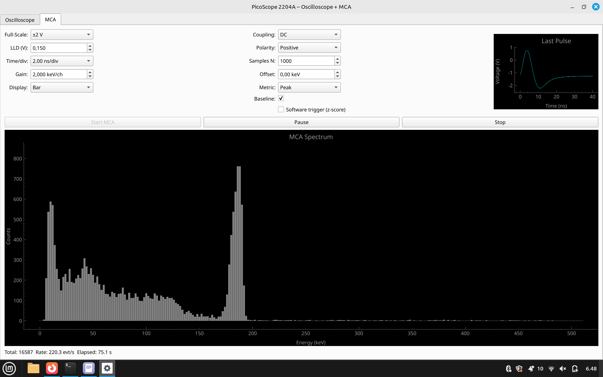

# PicoScope 2204A — Oscilloscope + MCA GUI

Python/PyQt application that turns a **PicoScope 2204A** (PS2000 series)  
into a small oscilloscope *and* a 256-channel multichannel analyser (MCA).

* **Live oscilloscope** with hardware trigger, noise measurement  
* **MCA mode** (256 bins) using peak-height discrimination  
* Optional baseline subtraction, bar/line spectrum view  
* Energy calibration via *Gain* (keV/ch) and *Offset*  
* Oversampling ×2 (ENOB ≈ 8.5 bit) enabled by default  

---

## Table of Contents
1. [Screenshots](#screenshots)
2. [Requirements](#requirements)
3. [Installation](#installation)
4. [Running](#running)
5. [File structure](#file-structure)
6. [Packaging for Windows](#packaging-for-windows)
7. [License](#license)

---

## Screenshots

| Oscilloscope | MCA Spectrum |
|--------------|--------------|
|  |  |

---

## Requirements

| Dependency | Tested version | Notes |
|------------|---------------|-------|
| Python     | 3.9 – 3.12 | 64-bit recommended |
| PicoSDK    | 10.7+ | Install Pico Technology “PS2000 SDK” (includes `ps2000.dll` / `libps2000.so`) |
| PyQt5      | 5.15 | or PyQt6 / Qt 6 with minor tweaks |
| pyqtgraph  | 0.13 | plotting |
| numpy      | 1.25 | maths |

```bash
pip install pyqt5 pyqtgraph numpy picosdk
```

> **Linux:** also install `libusb-1.0-0-dev` and run `sudo udevadm control --reload-rules` after PicoSDK install.
You need also Pico Drivers wich are available here: https://www.picotech.com/downloads/linux
---

## Installation

```bash
git clone https://github.com/your-username/picoscope-mca.git
cd picoscope-mca
python -m venv .venv
source .venv/bin/activate  # Windows: .venv\Scripts\activate
pip install -r requirements.txt
```

*(`requirements.txt` contains the libraries listed above)*

Make sure the PicoScope is plugged in and the PicoSDK driver is in your `PATH`  
(or installed system-wide on Linux).

---

## Running

```bash
python gui.py
```

### Controls

| Tab | Widget | Function |
|-----|--------|----------|
| Oscilloscope | **Full-Scale** | ±50 mV … ±20 V |
|     | **Time/div** | PicoScope time-base 0–25 |
|     | **HW Trigger** | enable + polarity + threshold |
| MCA | **LLD (V)** | lower-level discriminator |
|     | **Gain / Offset** | energy calibration (keV = gain·ch + offset) |
|     | **Baseline** | subtract average of first 10 % samples |
|     | **Display** | Bar / Line spectrum |

Oversampling is fixed to **2×**.
---

## File structure

```
├─ gui.py       # main PyQt GUI
├─ scope.py     # thin wrapper around picosdk.ps2000
├─ threads.py   # QThread workers (osc + mca)
├─ docs/
│  ├─ screenshot_gui.png
└─ requirements.txt
```

---


## License

Distributed under the **MIT License**.  
See [LICENSE](LICENSE) for details.

> PicoScope® is a trademark of Pico Technology.  
> This project is unaffiliated and provided “as is”.
