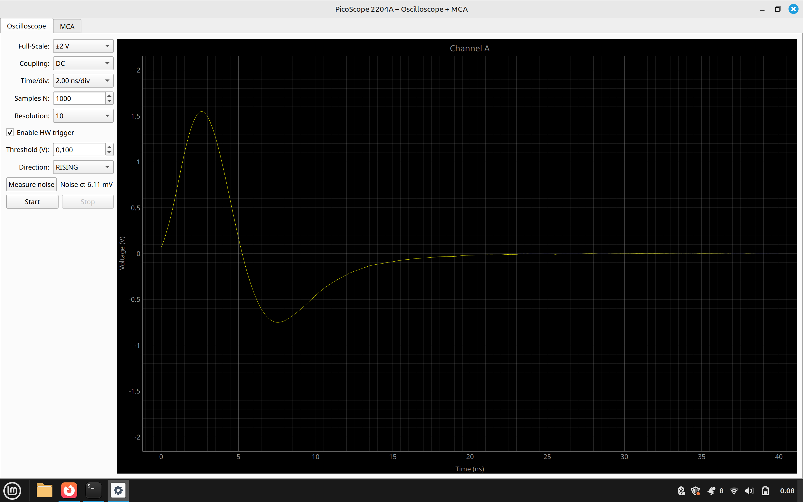
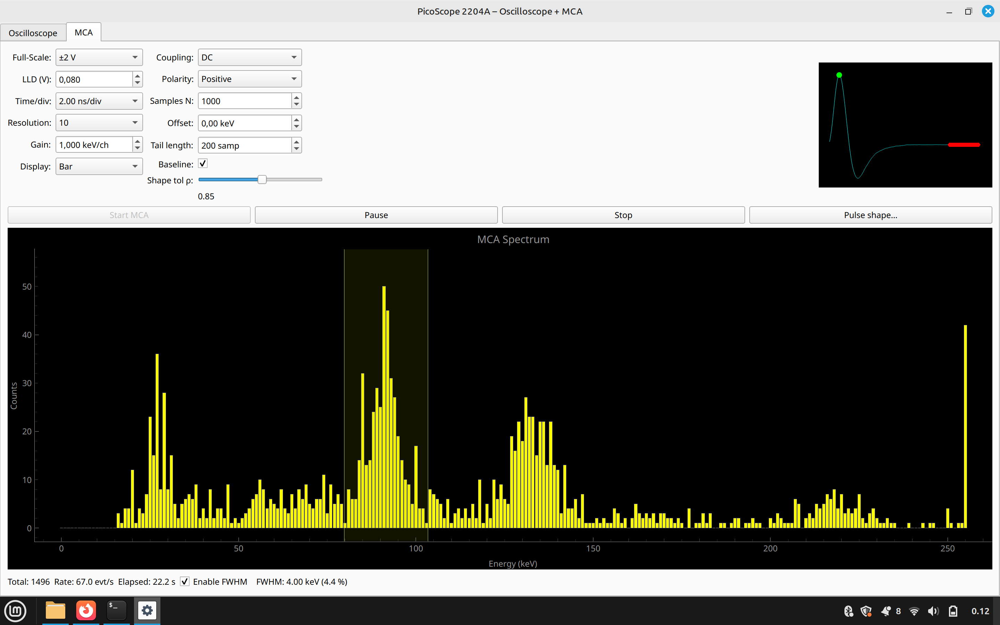

# PicoScope 2204A — Oscilloscope + MCA GUI

Python/PyQt application that turns a **PicoScope 2204A** (PS2000 series)  
into a small oscilloscope *and* a 256-channel multichannel analyser (MCA).

Features:

- **Live oscilloscope** with hardware trigger, resolution enhancement, noise meter  
- **MCA mode** with 256 bins (peak-height), shape filtering and baseline subtraction  
- Adjustable **Gain / Offset** calibration (energy = gain·channel + offset)  
- Display as **bars** or **line** plot  
- Oversampling ×2 enabled (≈8.5 bit ENOB)  
- **Pulse shape acquisition** and FWHM interpolation  
- Clean **MVC architecture** (controllers, views, models)

---

## Table of Contents
1. [Screenshots](#screenshots)
2. [Requirements](#requirements)
3. [Installation](#installation)
4. [Running](#running)
5. [How It Works](#how-it-works)
6. [Project Structure](#project-structure)
7. [Packaging for Windows](#packaging-for-windows)
8. [License](#license)

---

## Screenshots

| Oscilloscope | MCA Spectrum |
|--------------|--------------|
|  |  |

---

## Requirements

| Dependency | Tested version | Notes |
|------------|----------------|-------|
| Python     | 3.9 – 3.12     | 64-bit recommended |
| PicoSDK    | 10.7+          | Includes `ps2000.dll` / `libps2000.so` |
| PyQt5      | 5.15           | or PyQt6 with tweaks |
| pyqtgraph  | 0.13           | plotting |
| numpy      | 1.25           | maths |

Install dependencies:

```bash
pip install pyqt5 pyqtgraph numpy picosdk
```

> **Linux:** also install `libusb-1.0-0-dev` and run:  
> `sudo udevadm control --reload-rules` after installing PicoSDK.  
> Download drivers from: https://www.picotech.com/downloads/linux

---

## Installation

```bash
git clone https://github.com/your-username/picoscope-mca.git
cd picoscope-mca

python -m venv .venv
source .venv/bin/activate        # Windows: .venv\Scripts\activate

pip install -r requirements.txt
```

Make sure your PicoScope is plugged in and the driver is available  
via system `PATH` or standard library path.

---

## Running

```bash
python gui.py
```

---

### Controls overview

| Tab | Control | Description |
|-----|---------|-------------|
| Oscilloscope | Full-Scale | Select input range (±50 mV to ±20 V) |
|              | Time/div   | Adjust timebase (0–25) |
|              | Trigger    | Enable HW trigger + edge + threshold |
|              | Resolution | Select effective bits (8 to 10) |
|              | Noise      | Measure σ of baseline noise |
| MCA          | LLD (V)    | Lower-Level Discriminator |
|              | Gain       | Channel → keV conversion |
|              | Offset     | Energy shift (in keV) |
|              | Baseline   | Subtract tail average |
|              | Shape tol  | Correlation threshold for pulse filter |
|              | Display    | Bar or Line histogram |
|              | FWHM       | Live resolution over selected ROI |

---

## 📖 How It Works

- The **oscilloscope** tab uses `ps2000_run_block()` to acquire waveforms from Channel A with optional hardware trigger.  
- Samples are converted from ADC to volts, optionally enhanced via a moving average to simulate >8-bit resolution.
- The **MCA mode** identifies peaks from pulses (e.g. from a SiPM + scintillator), and bins them based on their peak amplitude.
- You can apply:
  - a **baseline correction** (tail average subtraction),
  - a **shape filter** based on correlation with a stored prototype pulse,
  - an **energy calibration** using gain and offset.
- **Pulse shape acquisition** lets you record an average pulse waveform from real signals. This is used for shape filtering.
- The code follows a clean **MVC pattern**:
  - `models/`: PicoScope wrapper
  - `controllers/`: logic and acquisition threads
  - `views/`: pure UI tabs (PyQt5)

This makes the code modular and easier to extend (e.g. new hardware, QML frontend).

---

## Project Structure

```
picoscope-mca/
├── gui.py              # Main window
├── threads.py          # Acquisition QThreads
├── models/
│   └── scope.py        # Simple PicoScope wrapper
├── controllers/
│   ├── osc_controller.py
│   └── mca_controller.py
├── views/
│   ├── osc_tab.py
│   └── mca_tab.py
├── docs/
│   ├── screenshot_osc.png
│   └── screenshot_mca_2.png
├── prototype.npz       # Saved pulse prototype (optional)
└── requirements.txt
```

---

## Packaging for Windows (optional)

You can bundle the application as a standalone `.exe` using [PyInstaller](https://www.pyinstaller.org/):

```bash
pip install pyinstaller
pyinstaller gui.py --noconfirm --onefile
```

Copy `ps2000.dll` next to the `.exe` or ensure it's available in `PATH`.

---

## License

This project is licensed under the **Creative Commons Attribution-NonCommercial-NoDerivatives 4.0 International (CC BY-NC-ND 4.0)** license.

> You may **share** the software with attribution, but may not use it for **commercial purposes** nor create **modified versions** without permission.

For full legal terms, see [LICENSE](LICENSE) or visit  
https://creativecommons.org/licenses/by-nc-nd/4.0/

---

> PicoScope® is a trademark of Pico Technology.  
> This project is unaffiliated and provided “as is”.

